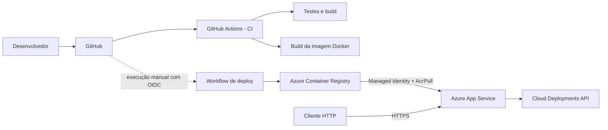

# Cloud Deployments API

API REST original em **.NET 8** criada para o desafio da DIO **Como Fazer o Deploy de uma API na Nuvem na Prática**. O projeto demonstra o ciclo completo de entrega de uma aplicação containerizada: desenvolvimento, testes, imagem Docker, Azure Container Registry, Azure App Service e automação com GitHub Actions.

> O repositório está pronto para implantação, mas não afirma que houve deploy remoto. A criação dos recursos depende de uma assinatura Azure e pode gerar cobrança.

## Objetivo

Registrar e acompanhar deployments de aplicações em três ambientes:

- `development`;
- `staging`;
- `production`.

Cada registro contém aplicação, versão, ambiente, status, datas e observações. A API permite criar, consultar, filtrar, atualizar e excluir esses registros.

## Arquitetura



## Funcionalidades

- API REST versionada em `/api/v1`;
- cadastro de deployments com validação de entrada;
- consulta individual e listagem com filtros;
- atualização de status e observações;
- exclusão de registros;
- endpoint de saúde em `/healthz`;
- documentação Swagger em `/swagger`;
- respostas de erro no padrão Problem Details;
- limite de 100 requisições por minuto nos endpoints da API;
- cabeçalhos básicos de segurança;
- testes unitários e de integração;
- imagem Docker multi-stage executada como usuário sem privilégios;
- pipeline de CI para formatação, build, testes e validação do container;
- workflow manual de deploy com autenticação OIDC;
- infraestrutura Azure declarada em Bicep;
- Azure Web App usando identidade gerenciada para baixar imagens privadas do ACR.

## Endpoints

| Método | Rota | Finalidade |
|---|---|---|
| `GET` | `/` | Metadados e links do serviço |
| `GET` | `/healthz` | Verificação de saúde |
| `GET` | `/api/v1/deployments` | Listar e filtrar registros |
| `GET` | `/api/v1/deployments/{id}` | Consultar um registro |
| `POST` | `/api/v1/deployments` | Criar um registro |
| `PATCH` | `/api/v1/deployments/{id}/status` | Atualizar status e observações |
| `DELETE` | `/api/v1/deployments/{id}` | Excluir um registro |

Filtros opcionais da listagem:

```http
GET /api/v1/deployments?environment=production&status=Succeeded
```

A especificação completa está em [`openapi.yaml`](openapi.yaml).

## Exemplo de uso

Registrar um deployment:

```bash
curl -i -X POST http://localhost:8080/api/v1/deployments \
  -H "Content-Type: application/json" \
  -d '{
    "application": "payment-api",
    "environment": "production",
    "version": "v1.4.0",
    "notes": "Release criada pela pipeline principal"
  }'
```

Resposta esperada — `201 Created`:

```json
{
  "id": "IDENTIFICADOR-GERADO",
  "application": "payment-api",
  "environment": "production",
  "version": "v1.4.0",
  "status": "Queued",
  "createdAt": "DATA-UTC",
  "updatedAt": "DATA-UTC",
  "notes": "Release criada pela pipeline principal"
}
```

Outros exemplos estão em [`docs/requests.http`](docs/requests.http).

## Tecnologias

- .NET 8 e ASP.NET Core;
- xUnit e `WebApplicationFactory`;
- Swagger/OpenAPI;
- Docker e Docker Compose;
- GitHub Actions;
- Azure Container Registry;
- Azure App Service for Linux Containers;
- Bicep e Azure CLI.

## Estrutura

```text
cloud-deployments-api/
├── .github/workflows/
│   ├── ci.yml
│   └── deploy-azure.yml
├── docs/
│   ├── DEPLOY-AZURE.md
│   ├── DESCRICAO-DIO.md
│   ├── EVIDENCIAS.md
│   ├── VALIDACAO.md
│   └── requests.http
├── infra/
│   └── main.bicep
├── scripts/
│   ├── delete-azure-resources.sh
│   └── deploy-azure.sh
├── src/CloudDeploy.Api/
├── tests/CloudDeploy.Api.Tests/
├── compose.yaml
├── Dockerfile
├── openapi.yaml
├── CloudDeploy.sln
└── README.md
```

## Executar com .NET

Pré-requisito: SDK do .NET 8.

```bash
dotnet restore --locked-mode
dotnet run --project src/CloudDeploy.Api
```

Acesse:

- API: `http://localhost:8080/`
- Swagger: `http://localhost:8080/swagger`
- Saúde: `http://localhost:8080/healthz`

## Executar com Docker

```bash
docker compose up --build
```

Para encerrar:

```bash
docker compose down
```

O container utiliza porta `8080`, sistema de arquivos somente leitura, remoção de capabilities e usuário sem privilégios.

## Testes

```bash
dotnet test --configuration Release
```

Com cobertura:

```bash
dotnet test \
  --configuration Release \
  --collect "XPlat Code Coverage" \
  --results-directory TestResults
```

Na revisão final, os **18 testes** foram aprovados com **100% de cobertura de linhas e branches**. O relatório completo está em [`docs/VALIDACAO.md`](docs/VALIDACAO.md).

## Integração e entrega contínuas

### CI

O workflow [`.github/workflows/ci.yml`](.github/workflows/ci.yml) executa automaticamente:

1. restauração travada pelo `packages.lock.json`;
2. verificação de formatação;
3. build em modo Release;
4. testes e coleta de cobertura;
5. build da imagem Docker sem publicação.

### Deploy

O workflow [`.github/workflows/deploy-azure.yml`](.github/workflows/deploy-azure.yml) é **manual**. Quando configurado, ele:

1. autentica no Azure com OpenID Connect, sem senha permanente;
2. cria uma imagem identificada pelo SHA do commit;
3. publica a imagem no Azure Container Registry;
4. atualiza o container do Azure Web App;
5. reinicia o serviço e verifica `/healthz`.

As instruções completas estão em [`docs/DEPLOY-AZURE.md`](docs/DEPLOY-AZURE.md).

## Segurança

- o container não executa como `root`;
- o ACR mantém o usuário administrador desabilitado;
- o App Service usa identidade gerenciada e a função `AcrPull`;
- o GitHub Actions usa OIDC no fluxo de deploy;
- nenhuma credencial é armazenada no código;
- o App Service exige HTTPS, TLS 1.2 ou superior e mantém FTPS desabilitado;
- entradas são validadas por tamanho, formato e valores permitidos;
- erros internos não são devolvidos ao cliente;
- a imagem recebe uma tag imutável baseada no commit.

Consulte também [`SECURITY.md`](SECURITY.md).

## Persistência e limitações

Este projeto usa armazenamento em memória para manter o foco no processo de containerização e deploy. Os registros são perdidos quando a aplicação reinicia e não são compartilhados entre múltiplas instâncias.

Para produção, substitua o repositório em memória por Azure SQL, PostgreSQL ou Cosmos DB e adicione autenticação, autorização, observabilidade e políticas específicas do ambiente.

## Material para a DIO

- [`docs/DESCRICAO-DIO.md`](docs/DESCRICAO-DIO.md): nome do repositório e descrição pronta para entrega;
- [`docs/EVIDENCIAS.md`](docs/EVIDENCIAS.md): checklist de evidências reais para adicionar após um deploy;
- [`docs/VALIDACAO.md`](docs/VALIDACAO.md): testes e verificações executadas.

## Custos

O template usa um Azure App Service Plan `B1` e um Azure Container Registry `Basic`. Esses recursos podem gerar cobrança enquanto existirem. Depois dos testes, exclua o grupo de recursos conforme indicado na documentação.

## Referências

- [ASP.NET Core](https://learn.microsoft.com/aspnet/core/)
- [Contêineres .NET](https://learn.microsoft.com/dotnet/core/docker/introduction)
- [Contêiner personalizado no Azure App Service](https://learn.microsoft.com/azure/app-service/configure-custom-container)
- [Deploy de contêiner com GitHub Actions](https://learn.microsoft.com/azure/app-service/deploy-container-github-action)
- [Azure Container Registry](https://learn.microsoft.com/azure/container-registry/)
- [Bicep](https://learn.microsoft.com/azure/azure-resource-manager/bicep/)

## Licença

Distribuído sob a licença MIT. Consulte [`LICENSE`](LICENSE).
